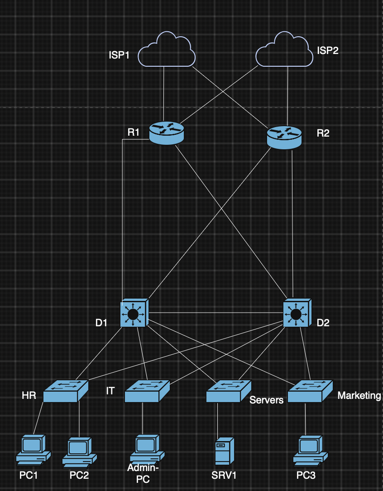

# [Enterprise 2-Tier Network]

## 1. Overview
<!-- نبذة عامة ومختصرة عن المشروع -->


## 2. Network Topology
The lab is designed using a hierarchical campus network model comprising 6 switches and 2 routers:

- **Core / Routing Layer:**
  - `R1`, `R2` providing inter-area routing and redundant gateway paths.
- **Distribution Layer:**
  - `D1`, `D2` acting as aggregation multilayer switches with redundant trunk links (`f1/14 - 15`).
- **Access Layer:**
  - `HR`, `IT`, `Marketing`, and `Servers` switches providing network connectivity to end-user segments.
- **Services & Endpoints:**
  - `SRV1`: Dedicated central DHCP & DNS Server connected directly to the `Servers` switch via `Ethernet1/0`.
  - Client endpoints: `PC1`, `PC2`, `Admin-PC`, `PC3`, and `PC4`.
- **Automation Node:**
  - An independent Docker container connected to `D1` via `FastEthernet1/4` for network automation tasks.




## 3. Implemented Security Policies
<!-- تعداد سياسات الأمان المنفذة -->
- 
- 
- 


## 4. Technical Challenges & Solutions
<!-- التحديات البرمجية والهندسية التي واجهتك أثناء التنفيذ وكيف قمت بحلها -->


## 5. Prerequisites & Environment
<!-- بيئة العمل والمكتبات والأدوات المستخدمة -->
- 
- 


## 6. Execution Guide
<!-- خطوات وأوامر تشغيل السكربتات -->
```bash