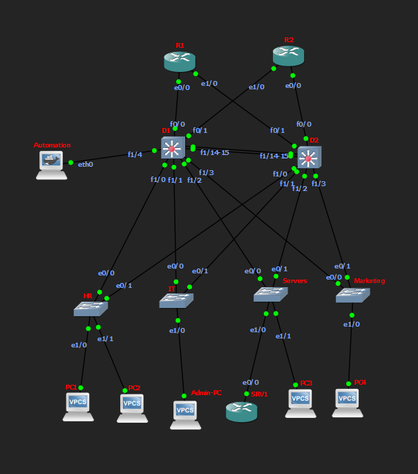
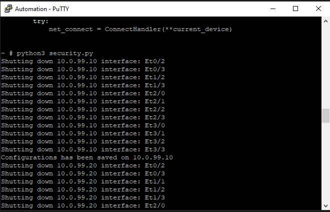
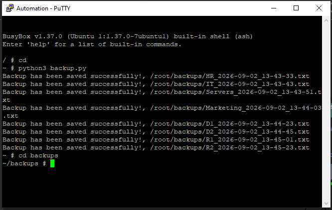
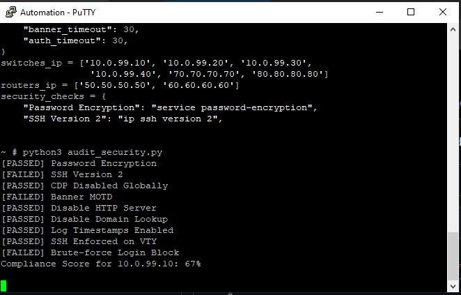

# [Enterprise 2-Tier Network]

## 1. Overview
This project demonstrates the design, deployment, and programmatic management of a secure, highly available **2-Tier Collapsed Core Enterprise Network**. 

The infrastructure incorporates Layer 2 and Layer 3 redundancy, dynamic routing, and multi-layered defense-in-depth security policies. To eliminate configuration drift and manual operational overhead, critical administrative tasks—including baseline security hardening, compliance auditing, and configuration backups—are fully automated using Python and Netmiko from a dedicated automation node.


## 2. Network Topology
The lab is built using a collapsed-core (2-Tier) hierarchical network architecture:

- **Collapsed Core / Distribution Layer:**
  - `D1` and `D2` serving as the core routing and aggregation layer, interconnected via redundant trunk links (`f1/14 - 15`).
  - Edge routing upstream to `R1` and `R2` for external/WAN connectivity.
- **Access Layer:**
  - `HR`, `IT`, `Marketing`, and `Servers` switches providing Layer 2 access and endpoint segmentation.
- **Services & Endpoints:**
  - `SRV1`: Dedicated central DHCP & DNS Server connected directly to the `Servers` switch via `Ethernet1/0`.
  - Client endpoints: `PC1`, `PC2`, `Admin-PC`, `PC3`, and `PC4`.
- **Automation Node:**
  - An independent Docker container connected to `D1` via `FastEthernet1/4` executing configuration and security tasks.




## 3. Network Architecture & Security Implementation

### High Availability & Performance
- **2-Tier Architecture:** Collapsed core design integrating core routing and distribution switching into `D1` and `D2`.
- **First Hop Redundancy (HSRP):** Active/Standby default gateway redundancy providing seamless client failover.
- **Link Aggregation (Static EtherChannel):** Multi-link EtherChannel bundles configured between distribution switches (`D1` and `D2`) for inter-switch traffic forwarding and link-level redundancy.
- **Dual-Homed Edge:** Redundant uplinks connecting access layer switches to both distribution nodes.
- **Loop Prevention & Fast Convergence:** Rapid Per-VLAN Spanning Tree (RPVST+) with PortFast enabled on all access edge ports.
- **Network Segmentation:** Dedicated VLANs isolating departments (HR, IT, Marketing, Servers, and Management).

### Routing Architecture
- **Dynamic Routing (OSPF):** Area 0 single-area OSPF deployed across distribution multilayer switches and core routers (`R1`, `R2`).
- **Static & Default Routing:** Static exit routes configured at the edge boundary for deterministic upstream traffic forwarding.

### Security Hardening
- **Layer 2 Protection:**
  - Port Security enabled on user access ports to restrict MAC addresses and mitigate MAC flooding.
  - DHCP Snooping active across all user VLANs with explicit trust paths toward `SRV1`.
  - BPDU Guard and BPDU Filter enabled on edge ports to neutralize rogue switch insertion.
  - Automated identification and shutdown of all unused interfaces across the switching infrastructure.
  - CDP globally deactivated to prevent unauthorized network mapping.
- **Layer 3 Hardening:**
  - Standard ACLs applied to VTY lines to restrict SSH management access to authorized users only.
  - OSPF passive interfaces applied on all non-transit and user-facing Layer 3 interfaces to prevent unauthorized neighbor adjacencies.

### Network Services
- **Centralized DHCP & DNS:** Dedicated `SRV1` node attached to the `Servers` switch providing automated addressing and internal name resolution.

### Network Automation & Programmability
- **Automated Security Deployment:** Python (`Netmiko`) workflow executing automated baseline hardening and port shutdown routines.
- **Automated Backup:** Scripted retrieval and timestamped local archival of device running configurations.
- **Automated Audit:** Programmatic state validation verifying compliance against security baselines.


## 4. Technical Challenges & Solutions

- **Challenge 1: Programmatically Identifying Inactive Ports**
  - **Issue:** Layer 2 switchports cannot be reliably audited through IP status commands (`show ip interface brief`), and line-protocol states alone fail to differentiate between temporarily disconnected endpoints and intentionally unused ports.
  - **Solution:** Implemented a description-driven convention where all authorized, active interfaces are tagged with explicit descriptions. The automation script parses `show interfaces description`, treating any port without an assigned description as unallocated and safely applying automated `shutdown` routines.

- **Challenge 2: Dynamic Prompt & Virtual Image Latency**
  - **Issue:** Network execution commands occasionally timed out during batch hardening operations due to CPU spikes and delayed command execution inside GNS3.
  - **Solution:** Tuned Netmiko connection parameters by optimizing `delay_factor` and implementing robust exception handling (`NetmikoTimeoutException`, `NetmikoAuthenticationException`) to allow the automation pipeline to gracefully handle latency without halting the entire run.

- **Challenge 3: EtherChannel Negotiation Failure in Virtualized Environment**
  - **Issue:** Dynamic LACP negotiations failed to establish properly between distribution nodes (`D1` and `D2`) due to IOU virtual emulation constraints.
  - **Solution:** Standardized link aggregation using static EtherChannel bundles (`channel-group mode on`), eliminating control plane negotiation overhead while ensuring predictable cross-link trunking and redundancy.


## 5. Prerequisites & Environment
- **Simulation Platform:** GNS3 environment running Cisco IOU (IOS on Unix) / Cisco IOS devices.
- **Runtime & OS:** Linux environment inside a Docker container (used for shell management, environment setup, and inventory structure).
- **Python Version:** Python 3.8+
- **Dependencies:**
  - `netmiko`
- **Network Access:** SSH enabled across all target network devices with configured credentials and privileged EXEC secret.


## 6. Execution Guide
1. Access the console of the `Automation` Docker container in GNS3.
2. Verify management reachability to target devices:
```bash
   ping -c 3 10.0.99.10
```
3. Install required dependencies:
```bash
   pip install netmiko
```
4. Run the security hardening script:
```bash
   python3 Scripts/security.py
```



5. Run the configuration backup script:
```bash
   python3 Scripts/backup.py
```



6. Run the compliance audit script:
```bash
   python3 Scripts/audit_security.py
```



